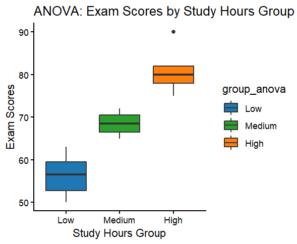

# Mini Data Project
This project involves analyzing the relationship between study hours and exam scores to determine whether they are correlated. It involves a series of testing methods and a scatter plot to showcase the trends. 
## Pearson and Correlation Test
## ANOVA test
Comparing exam scores by low, medium and high study hours groups.

## t-test
## Chi-Square Test
